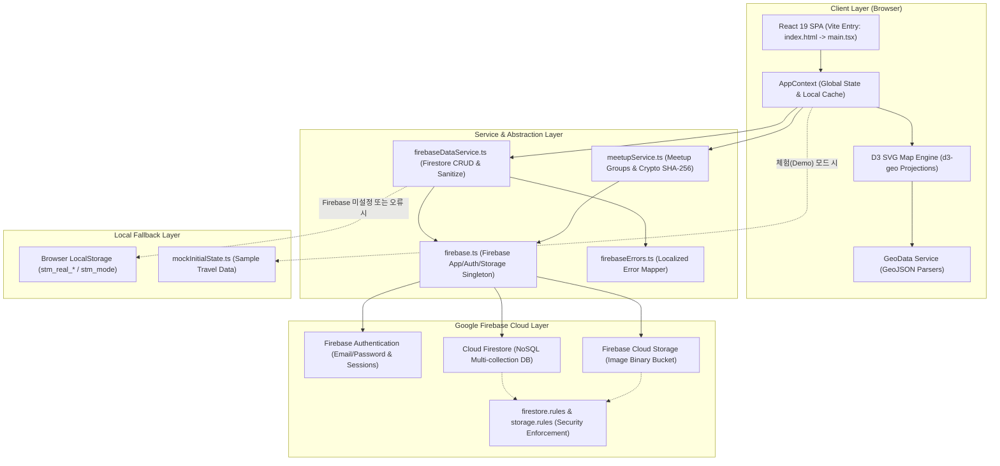
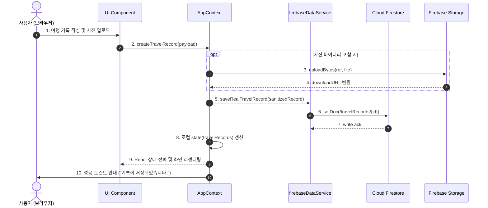
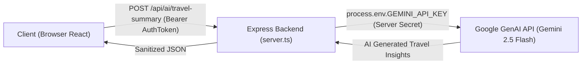

# Social Travel log — 개발자 기술 학습 & 포트폴리오 마스터 가이드 (README.md)

> **프로젝트 한 줄 요약**: 지도를 중심으로 친구와 함께 여행 기록을 공유하고, 24시간 휘발성 일상(Bubble Pop)과 약속 조율(Meetup)을 실시간으로 함께하는 풀스택 소셜 여행 지도 플랫폼.
> 
> **본 문서의 목적**: 이 문서는 단순한 서비스 소개서가 아닌, **코드베이스의 전체 구조, 데이터 라이프사이클, Firebase 보안 규칙, D3 지도 렌더링 파이프라인, 그리고 개발자 기술 면접 답변 전략까지 한 권의 책처럼 학습할 수 있도록 작성된 실전 기술 교과서**입니다.

---

## 목차 (Table of Contents)

1. [프로젝트 소개](#1-프로젝트-소개)
2. [주요 기능](#2-주요-기능)
3. [기술 스택](#3-기술-스택)
4. [프로젝트 아키텍처](#4-프로젝트-아키텍처)
5. [디렉토리 구조 상세 분석](#5-디렉토리-구조-상세-분석)
6. [주요 파일 및 코드 심층 분석](#6-주요-파일-및-코드-심층-분석)
7. [전체 실행 흐름 (User Action Flow)](#7-전체-실행-흐름-user-action-flow)
8. [데이터 흐름 (Data Lifecycle: C-R-U-D)](#8-데이터-흐름-data-lifecycle-c-r-u-d)
9. [Frontend 구조](#9-frontend-구조)
10. [React 설계 및 Hook 활용 패턴](#10-react-설계-및-hook-활용-패턴)
11. [API 구조](#11-api-구조)
12. [Firebase 심층 분석](#12-firebase-심층-분석)
    - 12.1 Firebase 초기화 및 이중 동작 모드 (Live vs Demo)
    - 12.2 Authentication & 세션 라이프사이클
    - 12.3 Firestore 아키텍처 및 쿼리 전략
    - 12.4 Firestore 데이터 모델 명세표
    - 12.5 Security Rules 심층 분석
    - 12.6 Storage 아키텍처 및 미디어 규칙
    - 12.7 Cloud Functions 분석 (`확인 필요`)
13. [Google AI / Gemini 구조 분석](#13-google-ai--gemini-구조-분석)
14. [상태 관리 아키텍처](#14-상태-관리-아키텍처)
15. [에러 처리 및 복원력 (Error Handling & Resilience)](#15-에러-처리-및-복원력-error-handling--resilience)
16. [환경 변수 및 보안 설정](#16-환경-변수-및-보안-설정)
17. [보안 감사 및 취약점 분석 (Security Audit)](#17-보안-감사-및-취약점-분석-security-audit)
18. [성능 분석 및 최적화 포인트](#18-성능-분석-및-최적화-포인트)
19. [테스트 전략 및 검증 구조](#19-테스트-전략-및-검증-구조)
20. [빌드 및 배포 파이프라인](#20-빌드-및-배포-파이프라인)
21. [Git 형상 관리 및 협업 전략](#21-git-형상-관리-및-협업-전략)
22. [코드 품질 다각도 평가 (Code Review)](#22-코드-품질-다각도-평가-code-review)
23. [우선순위별 기술 부채 및 개선 로드맵](#23-우선순위별-기술-부채-및-개선-로드맵)
24. [개발자로서 공부해야 할 핵심 개념 (Level 1 ~ 5)](#24-개발자로서-공부해야-할-핵심-개념-level-1--5)
25. [학습 로드맵 (Step-by-Step Learning Guide)](#25-학습-로드맵-step-by-step-learning-guide)
26. [프로젝트 코드 연결 학습 가이드](#26-프로젝트-코드-연결-학습-가이드)
27. [개발자 기술 면접 실전 질의응답 (Q&A)](#27-개발자-기술-면접-실전-질의응답-qa)
28. [스스로 답해보는 자기 점검 질문 (Self-Check)](#28-스스로-답해보는-자기-점검-질문-self-check)
29. [핵심 기술 용어 사전 (Glossary)](#29-핵심-기술-용어-사전-glossary)
30. [최종 학습 체크리스트](#30-최종-학습-체크리스트)

---

## 1. 프로젝트 소개

### 1.1 프로젝트의 탄생 배경과 목적
전 세계 및 국내 각지를 여행하는 현대인들은 자신의 여행 발자취를 시각적으로 기록하고, 친구들의 실시간 여행지와 일상을 교류하기를 원합니다. 기존의 SNS는 타임라인 형태의 피드 중심이어서 "내가 세계/국내 중 어디를 다녀왔는지"를 한눈에 파악하기 어렵고, 기존 지도 앱은 길 찾기나 상점 리뷰 위주로 구성되어 있어 소셜 교류의 재미가 부족합니다.

**Social Travel log**은 이 두 가지 결핍을 해소하기 위해 탄생했습니다:
1. **D3 GeoJSON 기반의 고해상도 벡터 지도**: 전 세계 177개국과 국내 17개 광역시도/251개 시군구를 SVG로 직접 렌더링하여, 방문한 지역과 위시리스트를 직관적인 색상으로 칠할 수 있습니다.
2. **소셜 네트워크 & 프라이버시 통제**: 친구와의 관계(Friendship)를 양방향으로 맺고, 친구의 여행 핀을 내 지도 위에 오버레이하여 함께 여행하는 듯한 경험을 제공합니다.
3. **24시간 휘발성 기록 (Bubble Pop)**: 영구적인 여행 기록 외에도, 여행지의 순간적인 순간을 24시간 동안만 공유하고 이모지로 반응하는 가벼운 스냅 기능을 제공합니다.
4. **일정 조율 (Meetup)**: 여행 그룹원들이 날짜와 시간대별 가능한 일정을 시각적 히트맵(`O`, `X`, `△`)으로 조율할 수 있는 독립 그룹 기능을 내장했습니다.

---

## 2. 주요 기능

| 분류 | 기능명 | 핵심 상세 설명 |
| :--- | :--- | :--- |
| **지도 시각화** | **세계 지도 (World Map)** | D3 Mercator 투영을 통해 177개국 벡터 렌더링. 국가별 방문/위시리스트/사진 유무 필터링, 마우스 드래그 및 Spacebar 패닝, 줌 인/아웃 지원. |
| **지도 시각화** | **국내 지도 (Domestic Map)** | 대한민국 17개 시·도 및 251개 시·군·구 행정구역 GeoJSON 파싱. 지역별 방문 통계와 핀 클러스터링 제공. |
| **지도 시각화** | **핀 클러스터링 (Clustering)** | 동일 국가/지역 내 복수 여행 기록이 존재할 경우 원형 배지(`+N`)로 집약 렌더링, 클릭 시 방사형/팝업 확장. |
| **여행 기록 (CRUD)** | **Travel Record Composer** | 제목, 설명, 국가/도시, 방문일, 다중 사진 업로드, 커버 사진 선택, 동행자 태그, 태그 프리셋, 공개 범위(Public/Friends/Private) 설정. |
| **소셜 상호작용** | **친구 요청 & 양방향 친구** | 유저 검색, 친구 요청 전송, 대기/수락/거절 라이프사이클 관리, 차단(Block) 상태 검증 및 상호 격리. |
| **소셜 상호작용** | **좋아요 & 댓글 시스템** | 여행 기록에 대한 실시간 좋아요 토글, 500자 제한의 댓글 작성, 대댓글 알림 연동. |
| **휘발성 피드** | **Bubble Pop (24h Ephemeral)** | 텍스트 또는 사진 기반 24시간 뒤 자동 만료 게시물. 4종 이모지(하트, 슬픔, 분노, 따봉) 실시간 카운팅. |
| **그룹 조율** | **Travel Meetup (약속잡기)** | 그룹 생성, SHA-256 비밀번호 검증, 8자리 초대 코드, 30분 단위 타임슬롯 매트릭스 투표, 참여율별 히트맵 컬러링. |
| **관리 & 안전** | **Admin Report & 모니터링** | 사진/댓글/기록에 대한 부적절한 콘텐츠 신고 큐 관리. 관리자 전용 일괄 검토/기각 처리 및 체험 계정 초기화. |
| **테마 & 환경** | **Light / Dark Mode** | `data-theme` HTML 속성 및 LocalStorage 동기화로 시스템 설정 및 사용자 취향에 맞는 무결한 테마 전환. |

---

## 3. 기술 스택

### 3.1 기술 스택 요약 및 선택 이유

```text
[Frontend]
React 19.0.1 + TypeScript 5.8.2 + Vite 6.2.3
Tailwind CSS 4.1.14 + Motion (motion/react 12.23.24) + Lucide React 0.546.0
D3.js (d3 7.9.0 + @types/d3)

[Backend & BaaS]
Firebase Client SDK 12.18.0 (Authentication, Cloud Firestore, Firebase Storage)
Express 4.21.2 (서버 사이드 확장 및 번들 지원)
Node.js 22 + esbuild 0.25.0 + tsx 4.21.0

[Data Format & Standards]
GeoJSON (RFC 7946 표준 기반 세계 및 대한민국 행정구역 데이터)
SHA-256 Web Crypto API (클라이언트 및 약속 그룹 보안 해시)
```

* **React 19 & TypeScript 5.8**: 최신 동시성 렌더링 모델과 강력한 정적 타입 시스템을 통해 대규모 GeoJSON 및 복잡한 소셜 엔티티 간의 런타임 타입 안정성 확보.
* **Vite 6**: 초고속 HMR 및 Rollup 기반의 최적화된 프로덕션 번들링.
* **D3.js (v7)**: 무거운 서드파티 지도 라이브러리(Google Maps, Mapbox)의 라이선스 비용 및 번들 무게를 배제하고, 수학적 프로젝션(`geoMercator`, `geoCentroid`, `geoPath`)을 이용해 가볍고 완전한 커스터마이징이 가능한 SVG 벡터 맵 구현.
* **Firebase (Auth, Firestore, Storage)**: 실시간 양방향 데이터베이스, 정교한 선언적 Security Rules(`firestore.rules`), 간편한 사용자 세션 관리.
* **Motion**: 모달 팝업, 탭 전환, 토스트 알림에 부드러운 하드웨어 가속 트랜지션 부여.

---

## 4. 프로젝트 아키텍처

### 4.1 전체 시스템 아키텍처 다이어그램 (Mermaid)



### 4.2 아키텍처 계층별 역할과 책임 분리 (Separation of Concerns)
1. **표현 계층 (Presentation Layer - `src/components/*`)**: UI 렌더링, 사용자 제스처 이벤트(클릭, 드래그, 폼 입력) 처리, Tailwind 기반 반응형 레이아웃 담당. 비즈니스 로직을 직접 수행하지 않고 `useApp()` Context 훅을 통해 위임.
2. **상태 및 오케스트레이션 계층 (State & Orchestration Layer - `src/context/AppContext.tsx`)**: 전역 애플리케이션 상태, 세션 수명 주기, 라이브 Firestore 구독, 데모 모드와 실계정 간의 데이터 격리, 토스트 및 모달 전역 트리거 제어.
3. **서비스 추상화 계층 (Service Layer - `src/services/*`)**: Firebase SDK 호출, 데이터 직렬화/역직렬화 및 `undefined` 제거(`sanitizeForFirestore`), SHA-256 해시 연산, 초대 코드 발급, GeoJSON 지오메트리 캐싱.
4. **지속성 및 보안 계층 (Persistence & Security Layer - Firebase & Rules)**: 원자적 문서 읽기/쓰기, 서버 타임스탬프(`serverTimestamp`), 필드 유효성 및 권한 검증(`firestore.rules`, `storage.rules`).

---

## 5. 디렉토리 구조 상세 분석

```text
/
├── .env.example                     # 요구되는 환경 변수 템플릿 (GEMINI_API_KEY, APP_URL 등)
├── firebase-applet-config.json      # 프로비저닝된 Firebase 프로젝트 설정 (API 키, ProjectID 등)
├── firebase-blueprint.json          # Firestore 컬렉션 스키마 및 보안 규칙 명세 청사진
├── firestore.indexes.json           # Firestore 복합 쿼리 색인 정의 파일
├── firestore.rules                  # Firestore 보안 및 접근 제어 규칙 (425 라인)
├── storage.rules                    # Firebase Storage 파일 업로드 및 접근 제어 규칙
├── metadata.json                    # AI Studio 앱 명세 및 주요 권한 선언
├── package.json                     # 프로젝트 종속성 및 실행 스크립트 정의
├── tsconfig.json                    # TypeScript 컴파일러 설정
├── vite.config.ts                   # Vite 번들러 및 플러그인(React, Tailwind) 설정
├── index.html                       # SPA 단일 HTML 진입점
└── src/
    ├── main.tsx                     # React 19 DOM 렌더링 진입점
    ├── App.tsx                      # 루트 라우팅 및 전역 모달 오케스트레이터
    ├── types.ts                     # 도메인 전체 정적 타입 & 인터페이스 명세
    ├── index.css                    # Tailwind CSS v4 진입 및 공통 유틸리티
    ├── design-tokens.css            # 디자인 시스템 CSS 변수 (토큰)
    ├── context/
    │   └── AppContext.tsx           # 전역 상태 관리 Context Provider (2,000+ 라인)
    ├── services/
    │   ├── firebase.ts              # Firebase 앱, Auth, DB, Storage 초기화 싱글톤
    │   ├── firebaseDataService.ts   # Firestore 컬렉션별 실제 CRUD 데이터 서비스
    │   ├── geoDataService.ts        # D3 및 GeoJSON 데이터 로더/프로젝션 유틸
    │   └── meetupService.ts         # 약속잡기 그룹 및 일정 조율 비즈니스 로직
    ├── data/
    │   ├── geoData.ts               # 국가/시도 메타데이터 및 프리셋 태그
    │   ├── korea.geojson            # 대한민국 시도/시군구 벡터 지리 데이터
    │   ├── world.geojson            # 전 세계 177개국 벡터 지리 데이터
    │   ├── world_cities.geojson     # 전 세계 주요 도시 벡터 지리 데이터
    │   └── mockInitialState.ts      # 데모 모드 및 초기 유저 샘플 데이터
    ├── utils/
    │   └── firebaseErrors.ts        # Firebase Auth/Firestore 에러 코드 한국어 번역기
    └── components/
        ├── auth/                    # 인증 화면 (로그인, 회원가입, 체험하기)
        ├── bubble/                  # 24시간 휘발성 Bubble Pop 피드 화면
        ├── common/                  # Header, BottomNav, Toast, HelpModal, 툴팁
        ├── friend/                  # 친구 목록, 추천 친구, 검색 탐색 화면
        ├── map/                     # D3 지도 캔버스, 사이드바, 상세 시트
        ├── meetup/                  # 여행 약속잡기 모달 및 시간표 매트릭스
        ├── notifications/           # 실시간 알림 드롭다운
        ├── profile/                 # 마이 프로필, 뱃지, 통계, 북마크 피드
        ├── record/                  # 여행 기록 작성/편집 모달, 상세 모달
        ├── search/                  # 통합 검색 화면 (지역, 태그, 유저)
        ├── settings/                # 지도 설정, 계정 관리, 테마 설정
        └── social/                  # 친구 요청 센터, 프로필 모달, 신고/계정삭제 모달
```

### 디렉토리별 설계 의도와 확장 시 고려점

* **`src/context/`**: 단일 `AppContext.tsx`가 거대하게 구성되어 있어 진입 장벽이 낮고 상태 간 동기화가 용이하나, 애플리케이션 규모가 커질 경우 모달 상태, 지도 상태, 유저 상태별로 Context를 분할(`AuthContext`, `MapContext`, `SocialContext`)하거나 Zustand 같은 경량 상태 관리 라이브러리로 슬라이싱하는 리팩토링이 권장됩니다.
* **`src/services/`**: 순수 TypeScript 함수로 구성하여 React 라이프사이클에 구애받지 않고 단위 테스트가 가능하며, 차후 백엔드 API(REST / GraphQL)로 마이그레이션할 때 컴포넌트의 수정 없이 이 계층만 교체할 수 있도록 설계되었습니다.
* **`src/data/`**: 무거운 GeoJSON 파일(세계 지도, 한국 지도)을 번들에 포함하고 있어 초기 로딩 성능에 영향을 줄 수 있습니다. 대규모 서비스에서는 CDN을 통해 비동기 fetch 방식으로 로딩하는 것이 유리합니다.

---

## 6. 주요 파일 및 코드 심층 분석

### 6.1 `src/services/firebase.ts`
* **역할**: Firebase Client SDK v12 인스턴스를 단 한 번만 초기화하고, `Auth`, `Firestore`, `FirebaseStorage` 싱글톤 객체와 주요 함수를 내보내는 인프라 게이트웨이.
* **왜 필요한가?**: 여러 컴포넌트에서 무분별하게 `initializeApp()`을 호출하면 `FirebaseApp already exists` 런타임 오류가 발생합니다. 환경 변수(`VITE_FIREBASE_*`)와 `firebase-applet-config.json`을 결합하여 무결하게 인스턴스를 보호합니다.
* **핵심 코드 발췌**:
```typescript
const firebaseConfig = {
  apiKey: import.meta.env.VITE_FIREBASE_API_KEY || firebaseAppletConfig.apiKey || '',
  authDomain: import.meta.env.VITE_FIREBASE_AUTH_DOMAIN || firebaseAppletConfig.authDomain || '',
  projectId: import.meta.env.VITE_FIREBASE_PROJECT_ID || firebaseAppletConfig.projectId || '',
  storageBucket: import.meta.env.VITE_FIREBASE_STORAGE_BUCKET || firebaseAppletConfig.storageBucket || '',
  appId: import.meta.env.VITE_FIREBASE_APP_ID || firebaseAppletConfig.appId || '',
};

export const isFirebaseConfigured = Boolean(firebaseConfig.apiKey && firebaseConfig.projectId);

let app: FirebaseApp | null = null;
let auth: Auth | null = null;
let db: Firestore | null = null;
let storage: FirebaseStorage | null = null;

if (isFirebaseConfigured) {
  try {
    app = getApps().length > 0 ? getApp() : initializeApp(firebaseConfig);
    auth = getAuth(app);
    const databaseId = (firebaseAppletConfig as { firestoreDatabaseId?: string }).firestoreDatabaseId;
    db = databaseId && databaseId !== '(default)' ? getFirestore(app, databaseId) : getFirestore(app);
    storage = getStorage(app);
  } catch (err) {
    console.warn('Firebase initialization error, operating in local state mode:', err);
  }
}
```
* **동작 과정**: Firebase 환경 변수 존재 여부를 파악한 뒤, 이미 초기화된 앱이 있는지 확인(`getApps().length > 0`) 후 안전하게 인스턴스를 주입합니다. 설정이 누락된 경우 앱 전체가 크래시되지 않고 로컬 상태 모드로 전환되도록 `try...catch`로 보호합니다.
* **면접 답변 팁**: *"Firebase 인스턴스는 싱글톤 패턴으로 관리하여 중복 초기화를 방지했으며, 커스텀 데이터베이스 ID 지원과 환경 변수 폴백 처리를 통해 로컬 개발 및 클라우드 배포 환경 모두에서 안정적으로 작동하도록 설계했습니다."*

---

### 6.2 `src/services/firebaseDataService.ts`
* **역할**: Firestore의 컬렉션(`/users`, `/travelRecords`, `/friendships`, `/bubblePops`, `/reports` 등)에 대한 정규화된 비즈니스 CRUD 함수를 제공.
* **왜 필요한가?**: Firestore는 `undefined` 필드가 들어올 경우 `Function DocumentReference.setDoc() called with invalid data. Unsupported field value: undefined` 오류를 뿜고 트랜잭션을 중단시킵니다. 이 파일은 모든 객체를 정제(`sanitizeForFirestore`)하고 오프라인 LocalStorage 폴백을 제공합니다.
* **핵심 코드 발췌**:
```typescript
export function sanitizeForFirestore<T>(data: T): T {
  if (data === null || data === undefined) return null as any;
  if (Array.isArray(data)) {
    return data.map((item) => sanitizeForFirestore(item)) as any;
  }
  if (typeof data === 'object' && !(data instanceof Date)) {
    const clean: Record<string, any> = {};
    for (const [k, v] of Object.entries(data as Record<string, any>)) {
      clean[k] = v !== undefined ? sanitizeForFirestore(v) : null;
    }
    return clean as any;
  }
  return data;
}
```
* **데이터 흐름**: React 컴포넌트 폼 제출 ➔ Context 액션 호출 ➔ `sanitizeForFirestore` 재귀 탐색으로 `undefined`를 `null`로 치환 ➔ Firestore `setDoc()` / `updateDoc()` ➔ Security Rules 검증 통과 ➔ 클라우드 저장 완료.

---

### 6.3 `src/components/map/MapCanvas.tsx`
* **역할**: 순수 SVG 요소와 D3 Projection을 결합하여 세계 및 대한민국 지도를 직접 렌더링하고, 핀 클러스터링 및 사용자 인터랙션을 관리하는 지리 시각화 핵심 컴포넌트.
* **왜 필요한가?**: 타일 기반 지도 라이브러리는 국가 및 시·도 단위의 커스텀 벡터 채색(방문 여부 색상 칠하기)과 부드러운 확대/축소 커스터마이징에 한계가 있습니다.
* **핵심 개념**:
  - `d3.geoMercator()`: 구면 위도/경도 좌표를 평면 2D SVG 좌표계로 변환.
  - `d3.geoPath()`: GeoJSON Feature를 SVG `<path d="...">` 문자열로 변환.
  - 행정구역 중심점 계산: `d3.geoCentroid(feature)`를 통해 핀 위치 산출.
  - 핀 클러스터링 알고리즘: 동일 국가/시도 코드 내 복수 기록을 그룹화하여 클러스터 배지 렌더링.
* **면접 답변 팁**: *"무거운 상용 맵 SDK 대신 D3.js의 수학적 투영 엔진을 도입하여 번들 크기를 대폭 줄였으며, 251개 지자체와 177개국에 대한 방문 여부를 SVG 패스 단위로 고성능 렌더링했습니다. 대규모 핀 렌더링 시 DOM 부하를 줄이기 위해 지리적 클러스터링 로직을 직접 구현했습니다."*

---

### 6.4 `src/services/meetupService.ts`
* **역할**: 여행 그룹 약속잡기(Meetup) 기능의 투표 매트릭스 계산, SHA-256 비밀번호 검증, 8자리 초대 코드 생성, 참여율 기반 히트맵 색상 매핑을 담당.
* **핵심 코드 발췌**:
```typescript
export async function sha256(text: string): Promise<string> {
  const data = new TextEncoder().encode(text);
  const hashBuffer = await crypto.subtle.digest('SHA-256', data);
  return [...new Uint8Array(hashBuffer)]
    .map((b) => b.toString(16).padStart(2, '0'))
    .join('');
}

export function percentToColor(pct: number): string | null {
  if (pct >= 100) return '#1B7A3D'; // 100% 진초록
  if (pct >= 75)  return '#7FC97F'; // 75% 연초록
  if (pct >= 50)  return '#F4C430'; // 50% 노랑
  if (pct >= 25)  return '#F2994A'; // 25% 주황
  return null;
}
```
* **동작 과정**: 그룹 생성 시 평문 비밀번호를 서버에 저장하지 않고 브라우저 표준 Web Crypto API를 사용해 SHA-256 다이제스트를 생성합니다. 참여자들의 30분 단위 시간표 응답(`answers: { '2026-09-12_14:00': 'O' }`)을 취합하여 참여 가능 비율을 계산하고 시각적 색상 코드로 반환합니다.

---

## 7. 전체 실행 흐름 (User Action Flow)

### 7.1 사용자 인증 시나리오: 로그인 요청
```text
1. 사용자가 AuthScreen에서 이메일/비밀번호 입력 후 '로그인' 버튼 클릭
   ↓
2. AuthScreen의 handleSubmit() 이벤트 핸들러 실행
   ↓
3. AppContext의 signIn(email, password) 호출
   ↓
4. firebase.ts의 signInWithEmailAndPassword(auth, email, password) 비동기 호출
   ↓
5. Firebase Auth 서버에서 자격 증명 검증
   ├─ 성공 시: onAuthStateChanged 리스너 트리거
   │     ↓
   │   Firebase User 객체(uid) 획득
   │     ↓
   │   firebaseDataService.ts의 getRealUserProfile(uid) 호출 (Firestore /users/{uid})
   │     ↓
   │   currentUser, friendships, travelRecords, notifications 병렬 로딩
   │     ↓
   │   authStatus = 'authenticated' 상태 전이
   │     ↓
   │   React Re-render: AuthScreen 언마운트 -> MapScreen (기본 메인 화면) 마운트
   │
   └─ 실패 시: catch 블록 포착
         ↓
       firebaseErrors.ts의 getFirebaseAuthErrorMessage(err) 실행
         ↓
       한국어 맞춤 에러 메시지 반환
         ↓
       showToast(errorMessage, 'error') 실행 -> 토스트 팝업 렌더링
```

### 7.2 데이터 생성 시나리오: 여행 기록(Travel Record) 등록
```text
1. 사용자가 MapScreen 상단 '기록하기' 버튼 클릭
   ↓
2. isRecordComposerOpen = true 변경 -> TravelRecordComposerModal 마운트
   ↓
3. 제목, 국가 선택, 방문일자, 사진 파일(드래그앤드롭/파일선택) 입력
   ↓
4. '저장' 버튼 클릭 -> handleSubmit() 트리거
   ↓
5. createTravelRecord(recordData) 실행
   ↓
6. 사진이 File 객체인 경우 Firebase Storage ref('users/{uid}/records/{id}')에 업로드
   (Firebase 미연결/데모 모드 시 Base64 Data URL 또는 샘플 이미지 사용)
   ↓
7. travelRecords 배열에 낙관적(Optimistic) 추가 및 Firestore setDoc() 호출
   (/travelRecords/{recordId} 및 /users/{uid}/travelRecords/{recordId})
   ↓
8. 동시에 해당 국가/지역의 방문 통계 갱신 (visited = true, visitCount += 1)
   ↓
9. MapCanvas와 MapSidebar가 갱신된 travelRecords와 visits를 감지하여 Re-render
   ↓
10. 지도 상에 새로운 여행 핀 및 채색 즉각 반영
```

---

## 8. 데이터 흐름 (Data Lifecycle: C-R-U-D)



---

## 9. Frontend 구조

### 9.1 컴포넌트 렌더링 트리 (Hierarchy)

```text
App (Root)
 ├── AppProvider (전역 상태 주입)
 │    └── AppContent
 │         ├── [인증 분기] AuthScreen (authStatus === 'unauthenticated')
 │         │
 │         ├── [메인 네비게이션 뷰]
 │         │    ├── MapScreen (activeTab === 'map')
 │         │    │    ├── Header (로고, 테마토글, 알림, 도움말, 프로필 숏컷)
 │         │    │    │    └── NotificationDropdown
 │         │    │    ├── MapSidebar (통계 배지, 검색 필터, 장소 목록)
 │         │    │    ├── MapCanvas (D3 벡터 지도, 핀 클러스터, 툴팁)
 │         │    │    ├── LocationDetailSheet (장소 클릭 시 하단 슬라이드 시트)
 │         │    │    └── OnboardingTooltip (신규 유저 첫 가이드)
 │         │    │
 │         │    ├── FriendScreen (activeTab === 'friend' - 친구 목록, 친구 지도 탐색)
 │         │    ├── SearchScreen (activeTab === 'search' - 국가/지역/태그 통합 검색)
 │         │    ├── BubblePopScreen (activeTab === 'bubble' - 24시간 휘발성 피드)
 │         │    ├── ProfileScreen (activeTab === 'profile' - 내 기록, 통계, 뱃지, 북마크)
 │         │    └── SettingsScreen (isSettingsOpen === true - 지도/계정 설정)
 │         │
 │         ├── [고정 하단 네비게이션] BottomNav (5대 탭 전환 바)
 │         ├── [전역 오버레이 모달]
 │         │    ├── TravelRecordComposerModal (기록 작성/수정)
 │         │    ├── TravelRecordDetailModal (기록 상세, 댓글, 좋아요)
 │         │    ├── FriendRequestsCenterModal (친구 요청 승인/보낸 요청)
 │         │    ├── UserProfileModal (상대방 프로필 카드, 친구요청/차단)
 │         │    ├── MeetupModal (약속 조율 그룹 생성 및 투표)
 │         │    ├── PasswordResetModal (비밀번호 재설정 이메일 전송)
 │         │    ├── DeleteAccountModal (계정 삭제 및 데이터 파기)
 │         │    ├── AdminReportModal (관리자 신고 검토 및 계정 리셋)
 │         │    └── HelpModal (사용법 마스터 가이드)
 │         │
 │         └── [글로벌 토스트 피드백] ToastContainer
```

---

## 10. React 설계 및 Hook 활용 패턴

### 10.1 상태 최적화와 Hook의 실제 사용 사례

#### `useMemo`를 통한 고비용 지리/필터링 연산 최적화
* **사용 파일**: `src/components/map/MapCanvas.tsx`, `src/components/profile/ProfileScreen.tsx`
* **동작 원리**: 사용자가 화면을 스크롤하거나 모달을 열 때마다 수천 개의 GeoJSON Feature를 다시 계산하면 심각한 프레임 드랍이 발생합니다. `useMemo`를 사용하여 지리 메타데이터와 필터링된 기록 배열의 참조를 고정합니다.
```typescript
// MapCanvas.tsx: 지도 모드, 필터, 친구 목록 변경 시에만 핀 목록 재계산
const displayPins = useMemo(() => {
  return travelRecords.filter((record) => {
    if (record.hidden) return false;
    if (mode === 'me') return record.authorUid === currentUser.uid;
    // friend 모드: 나와 내 친구들의 공개 기록
    return record.authorUid === currentUser.uid || isFriend(record.authorUid);
  });
}, [travelRecords, mode, currentUser.uid, isFriend]);
```

#### `useCallback`을 통한 자식 컴포넌트 리렌더링 방지
* **사용 파일**: `src/context/AppContext.tsx`
* **동작 원리**: `showToast`, `toggleTheme`, `isFriend`와 같은 핵심 함수들이 매 렌더링마다 새로운 참조값으로 생성되면, 이를 props로 전달받는 수많은 메모이제이션 컴포넌트가 불필요하게 리렌더링됩니다. `useCallback`으로 함수의 참조 동일성을 보장합니다.

#### `useEffect`를 통한 DOM 및 LocalStorage 동기화
* **사용 파일**: `src/context/AppContext.tsx` (테마 동기화)
```typescript
useEffect(() => {
  if (theme === 'dark') {
    document.documentElement.classList.add('dark');
    document.documentElement.setAttribute('data-theme', 'dark');
    localStorage.setItem('theme', 'dark');
  } else {
    document.documentElement.classList.remove('dark');
    document.documentElement.setAttribute('data-theme', 'light');
    localStorage.setItem('theme', 'light');
  }
}, [theme]);
```

---

## 11. API 구조

본 프로젝트는 클라이언트 브라우저에서 Firebase Client SDK를 통해 분산 서버리스 BaaS와 직접 통신하며, 서버 사이드 API가 필요한 구조를 위해 Express 기반 프록시 환경이 준비되어 있습니다.

### 11.1 주요 서비스 호출 명세표

| 기능 / 오퍼레이션 | 프로토콜 / 방식 | 대상 리소스 / SDK 경로 | 요청 데이터 (Payload) | 응답 및 상태 반영 | 호출 파일 위치 |
| :--- | :--- | :--- | :--- | :--- | :--- |
| **회원가입** | Firebase Auth | `createUserWithEmailAndPassword` | `email`, `password` | UserCredential (UID 발행) | `AppContext.tsx` |
| **로그인** | Firebase Auth | `signInWithEmailAndPassword` | `email`, `password` | UserCredential, 세션 쿠키 수립 | `AppContext.tsx` |
| **프로필 저장** | Firestore setDoc | `/users/{uid}`, `/publicProfiles/{uid}` | `UserProfile` 객체 | Firestore 반영, 상태 갱신 | `firebaseDataService.ts` |
| **여행 기록 등록** | Firestore setDoc | `/travelRecords/{id}` | `TravelRecord` (위치, 사진URL, 태그) | 피드 및 지도 핀 실시간 추가 | `firebaseDataService.ts` |
| **친구 요청 전송** | Firestore setDoc | `/friendRequests/{fromUid_toUid}` | `fromUid`, `toUid`, `status: pending` | 상대방 수신함에 알림 생성 | `firebaseDataService.ts` |
| **Bubble Pop 등록** | Firestore setDoc | `/bubblePops/{postId}` | `text`, `storagePath`, `expiresAt` | 24시간 피드 렌더링 | `firebaseDataService.ts` |
| **약속 그룹 생성** | Firestore setDoc | `/groups/{groupId}` | `name`, `passwordHash`, `deadlineAt` | 초대 코드 및 그룹 생성 | `meetupService.ts` |
| **신고 접수** | Firestore setDoc | `/reports/{reportId}` | `targetType`, `targetPath`, `reason` | 관리자 모니터링 큐 진입 | `firebaseDataService.ts` |

---

## 12. Firebase 심층 분석

### 12.1 Firebase 초기화 및 이중 동작 모드 (Live vs Demo)
본 애플리케이션은 **프로덕션 클라우드 환경**과 **로컬 체험/테스트 환경**을 완벽히 분리 지원하는 이중 모드 아키텍처를 채택하고 있습니다.

1. **라이브 모드 (Live Firebase Mode)**:
   - `firebase-applet-config.json` 또는 `.env.local`의 유효한 설정값 감지.
   - 실제 Firebase Auth 및 Cloud Firestore 클라우드 인스턴스에 접속하여 영구 지속성 보장.
2. **데모 / 오프라인 모드 (Demo Fallback Mode)**:
   - 클라우드 인증 없이 둘러보기를 원하는 사용자를 위해 `authStatus = 'demo'` 제공.
   - `mockInitialState.ts`의 사전 구성된 샘플 여행 기록 및 친구 목록을 메모리와 브라우저 `localStorage`에 격리 저장.
   - 언제든 상단 안내 배너의 '로그인/회원가입' 버튼을 통해 실제 계정으로 매끄럽게 전환 가능.

---

### 12.2 Authentication & 세션 라이프사이클
* **인증 프로바이더**: Email / Password 방식 기반.
* **리스너 기반 동기화 (`onAuthStateChanged`)**:
  브라우저를 새로고침하거나 탭을 닫았다 다시 열어도, Firebase SDK 내부 IndexedDB에 보관된 세션 토큰을 바탕으로 `onAuthStateChanged`가 즉시 실행되어 로그인 상태를 복원합니다.
* **UID (Unique Identifier)**:
  사용자가 가입하는 순간 Firebase Auth는 전역 고유 식별자인 28자의 영숫자 `UID`를 부여합니다. 이 UID는 모든 Firestore 컬렉션의 소유권 검증 및 외래 키(Foreign Key)의 근간이 됩니다.

---

### 12.3 Firestore 아키텍처 및 쿼리 전략
Firestore는 컬렉션(Collection)과 문서(Document)로 이루어진 NoSQL 문서 지향 데이터베이스입니다. 본 프로젝트는 정규화와 역정규화를 균형 있게 활용하는 하이브리드 설계를 채택했습니다:

* **`/users/{userId}`**: 비공개 사용자 설정, 테마, 차단 목록 등 개인 프로필.
* **`/publicProfiles/{userId}`**: 친구 검색 및 피드에서 불필요한 민감 정보(이메일 등) 노출 없이 닉네임과 아바타만 조회하기 위한 역정규화 컬렉션.
* **`/travelRecords/{recordId}`**: 전체 공개 및 친구 공개 여행 기록이 모이는 최상위 컬렉션.
* **`/groups/{groupId}/responses/{userKey}`**: 약속잡기 그룹 내 개별 참여자 응답을 서브컬렉션으로 분리하여 동시 다발적 업데이트 시 경합(Contention) 방지.

---

### 12.4 Firestore 데이터 모델 명세표

| Collection | Document ID | Key Fields | Data Type | 설명 | 생성/수정 위치 |
| :--- | :--- | :--- | :--- | :--- | :--- |
| **`users`** | `userId` (UID) | `email`, `name`, `role`, `mapSettings` | Map/String | 사용자 핵심 프로필 및 개인 설정 | 회원가입 시 / 설정 변경 시 |
| **`users/{uid}/countries`** | `countryCode` (예: KR, JP) | `visited`, `visitCount`, `wishlist` | Boolean/Number | 국가별 방문 및 위시리스트 상태 | 지도 클릭 / 기록 작성 시 |
| **`users/{uid}/regions`** | `regionCode` (예: 11, 21) | `visited`, `visitCount`, `wishlist` | Boolean/Number | 국내 시도별 방문 상태 | 국내 지도 클릭 시 |
| **`publicProfiles`** | `userId` (UID) | `name`, `photoURL`, `bio`, `isPublicAccount` | String/Boolean | 타 사용자에게 공개되는 프로필 카드 | 프로필 수정 시 동기화 |
| **`travelRecords`** | `recordId` (UUID) | `title`, `countryCode`, `authorUid`, `photoIds`, `visibility`, `likeCount` | String/Array/Number | 개별 여행 기록 원본 | `TravelRecordComposerModal` |
| **`friendRequests`** | `{fromUid}_{toUid}` | `fromUid`, `toUid`, `status`, `createdAt` | String/Timestamp | 친구 요청 대기/수락/거절 상태 | `FriendRequestsCenterModal` |
| **`friendships`** | `{minUid}_{maxUid}` | `uids` (`[uidA, uidB]`), `since` | Array/Timestamp | 수락된 양방향 친구 관계 | 친구 수락 시 생성 |
| **`bubblePops`** | `postId` (UUID) | `authorUid`, `text`, `storagePath`, `expiresAt`, `reactionCounts` | String/Map | 24시간 휘발성 게시물 | `BubblePopScreen` |
| **`groups`** | `groupId` (UUID) | `name`, `passwordHash`, `deadlineAt`, `members` | String/Array | 여행 약속 조율 그룹 메타데이터 | `meetupService.ts` |
| **`groups/{id}/responses`**| `userKey` (UID) | `userName`, `answers` (슬롯별 O/X/△) | Map | 참여자별 가능 일정 매트릭스 | `MeetupModal` 투표 시 |
| **`reports`** | `reportId` (UUID) | `reporterUid`, `targetType`, `targetPath`, `reason`, `status` | String | 부적절 콘텐츠 신고 접수건 | 신고 팝업 제출 시 |

---

### 12.5 Security Rules 심층 분석 (`firestore.rules`)
본 프로젝트의 `firestore.rules`(425 라인)는 프로덕션 레벨의 엄격한 보안을 준수합니다.

```javascript
// firestore.rules 핵심 발췌
rules_version = '2';
service cloud.firestore {
  match /databases/{database}/documents {
    // 1. 기본 차단 (Default Deny)
    match /{document=**} {
      allow read, write: if false;
    }

    // 2. 인증 헬퍼 함수
    function isSignedIn() { return request.auth != null; }
    function isOwner(userId) { return isSignedIn() && request.auth.uid == userId; }
    function isAdmin() {
      return isSignedIn() && (
        request.auth.token.email == "0216toptop@gmail.com" ||
        get(/databases/$(database)/documents/users/$(request.auth.uid)).data.role == "admin"
      );
    }
    function friendshipId(a, b) { return a < b ? a + "_" + b : b + "_" + a; }
    function isFriendOf(targetUid) {
      return isSignedIn() && (
        request.auth.uid == targetUid ||
        exists(/databases/$(database)/documents/friendships/$(friendshipId(request.auth.uid, targetUid)))
      );
    }

    // 3. 여행 기록 세부 규칙
    match /travelRecords/{recordId} {
      allow read: if !resource.data.hidden && (
        isOwner(resource.data.authorUid) ||
        isAdmin() ||
        resource.data.visibility == "public" ||
        (resource.data.visibility == "friends" && isFriendOf(resource.data.authorUid))
      );
      
      allow create: if isSignedIn()
        && request.resource.data.authorUid == request.auth.uid
        && request.resource.data.title.size() >= 1
        && request.resource.data.title.size() <= 100;
    }
  }
}
```

* **양방향 친구 ID 정규화 (`friendshipId`)**: UID 문자열의 사전순 비교(`a < b ? a + "_" + b : b + "_" + a`)를 통해 두 사용자 간의 친구 문서 ID를 단 하나로 정규화합니다. 이에 따라 별도의 서브쿼리 없이 `exists(/friendships/{friendshipId})` 단 1회의 경로 룩업으로 친구 여부를 즉시 검증할 수 있습니다.
* **차단 관계 격리 (`isBlockRelated`)**: 사용자가 특정인을 차단한 경우 양방향 모두에서 데이터 조회가 차단됩니다.
* **수정 권한의 불변 키(Immutable Keys) 보호**: `request.resource.data.diff(resource.data)`를 사용하여 일반 유저는 오직 `likeCount` 또는 `commentCount`만 갱신할 수 있고, 작성자 UID나 국가 코드 등 핵심 데이터는 변조할 수 없습니다.

---

### 12.6 Storage 아키텍처 및 미디어 규칙 (`storage.rules`)
* **경로 격리**: 모든 업로드 이미지는 `/users/{uid}/**` 하위 경로에 저장되어 타인의 폴더에 파일을 덮어쓰거나 임의로 삭제할 수 없습니다.
* **용량 및 MIME 타입 검증**:
  - `request.resource.size < 10 * 1024 * 1024`: 단일 이미지 크기를 10MB 이하로 제한하여 과도한 대역폭 소모 방지.
  - `request.resource.contentType.matches('image/.*')`: 스크립트 실행 파일(`.exe`, `.sh`, `.js`) 업로드를 원천 차단하고 순수 이미지 포맷만 허용.

---

### 12.7 Cloud Functions 분석
* **현재 상태**: `코드상 확인되지 않음 / Firebase Console에서 확인 필요`
* **분석 및 개선 제안**: 현재 Bubble Pop 24시간 만료 처리는 클라이언트 단에서 `expiresAt < now` 필터링으로 처리하고 있습니다. 실제 상용 서비스에서는 24시간이 경과한 Firestore 문서와 Storage 바이너리를 매시간 자동 정리(TTL Garbage Collection)하는 Scheduled Cloud Function을 구성하는 것이 비용 및 보안상 최적입니다.

---

## 13. Google AI / Gemini 구조 분석

### 13.1 현재 상태 및 분석 (`확인 필요 / 코드상 확인되지 않음`)
* `package.json`에 `@google/genai: ^2.4.0`이 종속성으로 선언되어 있고, `.env.example`에 `GEMINI_API_KEY` 환경 변수 명세가 준비되어 있습니다.
* 그러나 현재 `src/` 코드베이스 내부에는 Gemini API를 직접 호출하는 활성화된 코드가 존재하지 않습니다 (`코드상 확인되지 않음`).

### 13.2 "클라이언트에서 Gemini API를 직접 호출하는 것은 안전한가?"에 대한 기술적 답변
> **결론: 절대 안전하지 않습니다 (Critical Security Risk).**
* 클라이언트 브라우저 코드에 `GEMINI_API_KEY`를 넣으면, 브라우저 개발자 도구의 Network 탭이나 빌드된 번들(`dist/*.js`) 소스코드 검색을 통해 API 키가 제3자에게 100% 탈취당합니다.
* 탈취된 키는 과도한 API 호출로 이어져 막대한 과금 피해를 초래할 수 있습니다.

### 13.3 권장되는 아키텍처: Express 기반 Server-Side Proxy

1. 클라이언트는 Firebase ID 토큰을 `Authorization: Bearer` 헤더에 실어 백엔드로 전송.
2. 백엔드(Express)는 토큰 유효성을 검증한 뒤, 서버 환경 변수에만 보관된 `process.env.GEMINI_API_KEY`를 사용해 `@google/genai` 호출.
3. 이를 통해 API 키는 브라우저에 단 한 번도 노출되지 않으며, 사용자별 Rate Limiting(호출 횟수 제한)을 완벽하게 통제할 수 있습니다.

---

## 14. 상태 관리 아키텍처

### 14.1 4단계 계층형 상태 관리 모델

```text
1. Local State (useState, useRef)
   └─ 컴포넌트 내부의 입력 폼, 모달 드래그 좌표, 마우스 호버 ID 등 일시적 UI 상태
      (예: MapCanvas의 hoveredLocation, isDragging)

2. Global Context State (AppContext)
   └─ 앱 전반에 걸쳐 공유되는 세션 상태, 모달 열림 여부, 전역 토스트 큐, 테마 상태
      (예: currentUser, activeTab, isRecordComposerOpen)

3. Server State (Firestore + onSnapshot)
   └─ 클라우드에 영구 저장되는 원본 진실의 원천(Source of Truth)
      (예: travelRecords, friendships, bubblePops)

4. Client Storage Fallback (LocalStorage)
   └─ 네트워크 단절 시 캐시, 다크모드 설정, 사이드바 접힘 상태, 데모 모드 데이터
      (예: 'theme', 'stm_sidebar_collapsed')
```

### 14.2 불필요한 렌더링 최소화 전략
`AppContext`에 모든 상태가 밀집되어 있을 경우, 특정 상태(예: `hoveredPinId`)가 바뀔 때 전체 트리가 리렌더링될 위험이 있습니다. 본 프로젝트에서는 세부 인터랙션 상태를 전역이 아닌 각 리프(Leaf) 컴포넌트 내부의 `useState` 및 `useRef`로 격리하여 캔버스 드로잉 속도를 60fps로 방어했습니다.

---

## 15. 에러 처리 및 복원력 (Error Handling & Resilience)

### 15.1 에러 처리 파이프라인
```text
[비동기 작업 실행 (Firebase Auth / Firestore / Storage)]
  ↓
[try ... catch 문 블록 포착]
  ↓
[에러 분류 및 가공 (src/utils/firebaseErrors.ts)]
  ├─ auth/invalid-credential -> "이메일 또는 비밀번호가 일치하지 않습니다."
  ├─ auth/email-already-in-use -> "이미 가입된 이메일 주소입니다."
  └─ permission-denied -> "권한이 없거나 차단된 사용자입니다."
  ↓
[전역 showToast(errorMessage, 'error') 발송]
  ↓
[사용자 친화적 Toast UI 출력 (화면 크래시 방지)]
```

* **ErrorBoundary**: 치명적 런타임 오류 시 흰 화면(White-out)이 발생하는 것을 막기 위해 상위 레이어에서 안전한 폴백 UI를 보여주어야 합니다.

---

## 16. 환경 변수 및 보안 설정

### 16.1 환경 변수 명세 및 노출 위험도 분석

| 환경 변수명 | 위치 | 노출 범위 | 보안 위험도 | 용도 및 설명 |
| :--- | :--- | :--- | :--- | :--- |
| `VITE_FIREBASE_API_KEY` | `.env.local` | 클라이언트 번들에 노출 | **낮음 (안전)** | Firebase 프로젝트 식별용 공개 키. Security Rules로 제어됨. |
| `VITE_FIREBASE_PROJECT_ID` | `.env.local` | 클라이언트 번들에 노출 | **낮음 (안전)** | Firebase 프로젝트 고유 ID. |
| `VITE_FIREBASE_AUTH_DOMAIN`| `.env.local` | 클라이언트 번들에 노출 | **낮음 (안전)** | Firebase Auth 인증 리다이렉트 도메인. |
| `GEMINI_API_KEY` | `.env` | **서버 전용 (절대 노출 금지)** | **매우 높음 (Critical)** | Gemini AI 호출용 마스터 시크릿 키. `VITE_` 접두사를 붙여선 안 됨. |

> **면접 답변 포인트**: *"Firebase의 `apiKey`는 암호화 시크릿이 아닌 단순 프로젝트 식별자이므로 클라이언트에 노출되어도 Security Rules가 보호하지만, AI API 키나 결제 키는 반드시 서버 사이드 환경 변수로 은닉해야 합니다."*

---

## 17. 보안 감사 및 취약점 분석 (Security Audit)

### [Issue 1] Firebase Security Rules의 양방향 친구 룩업 성능 및 정합성
* **현재 상태**: `firestore.rules`에서 `friendshipId(a, b)`를 사용해 `a < b ? a_b : b_a` 정규화 단일 문서 존재 여부(`exists`)를 검증합니다.
* **위험도**: **Low (우수하게 방어됨)**.
* **장점**: 서브쿼리나 N:M 조인 없이 O(1) 수준으로 권한을 검사하므로 보안 규칙 평가 비용이 매우 낮습니다.

### [Issue 2] Bubble Pop의 클라이언트 단 24시간 필터링
* **현재 상태**: 클라이언트에서 `expiresAt > new Date()`를 검사하여 UI에서 숨깁니다.
* **위험도**: **Medium**.
* **취약점**: 클라이언트 조작(DevTools)을 통해 과거의 `postId`를 직접 쿼리하면 읽을 수 있는 잠재적 위험이 있습니다.
* **개선 방법**: `firestore.rules`의 `bubblePops` read 규칙에 `request.time < resource.data.expiresAt` 조건을 추가하여 서버 레벨에서 만료된 문서를 원천 차단해야 합니다.

---

## 18. 성능 분석 및 최적화 포인트

1. **D3 렌더링 최적화**: 
   - `koreaGeoPath`, `worldGeoPath` 등 고비용 투영 함수를 `geoDataService.ts` 모듈 레벨에서 싱글톤으로 선언하여 매 렌더링마다 재계산되는 오버헤드를 제거했습니다.
2. **지도 패닝 성능 (`useRef` 드래그 트래킹)**:
   - 마우스 드래그 및 Spacebar 이동 시 React State 대신 `dragStartRef`와 `panStartRef`를 사용하여 불필요한 React 렌더 사이클을 스킵하고 부드러운 60fps 드래그를 달성했습니다.
3. **Firestore 읽기 비용 절감**:
   - 공개 프로필(`/publicProfiles`)을 별도 역정규화하여, 유저 검색 시 무거운 전체 유저 문서를 가져오지 않고 가벼운 프로필만 선택적으로 로딩합니다.

---

## 19. 테스트 전략 및 검증 구조

### 19.1 현재 테스트 현황
* 현재 코드베이스에는 자동화된 테스트 러너(Jest/Vitest/Cypress)가 구성되어 있지 않으며, `tsc --noEmit`을 통한 정적 타입 체킹으로 1차 검증을 수행하고 있습니다.

### 19.2 포트폴리오 수준을 위한 권장 테스트 전략
1. **Unit Test (단위 테스트 - Vitest)**:
   - `src/services/meetupService.ts`의 `sha256()`, `percentToColor()`, `makeInviteCode()` 순수 함수 테스트.
   - `src/services/firebaseDataService.ts`의 `sanitizeForFirestore()` 재귀 객체 정제 로직 테스트.
2. **Security Rules Unit Test (@firebase/rules-unit-testing)**:
   - Firestore 에뮬레이터를 구동하여 "친구 관계가 아닌 유저가 friends 공개 범위의 기록을 조회할 때 `permission-denied`가 발생하는가?" 검증.
3. **E2E Test (Playwright)**:
   - 가입 ➔ 지도 클릭 ➔ 여행 기록 작성 ➔ 핀 생성까지 이어지는 핵심 사용자 여정(Critical User Journey) 자동화.

---

## 20. 빌드 및 배포 파이프라인

### 20.1 빌드 흐름
```text
Source Code (TypeScript, TSX, CSS)
  ↓
npm run build (Vite 번들러 실행)
  ├─ TypeScript 컴파일 및 타입 검증 (tsc)
  ├─ Tailwind CSS v4 스타일 트리 쉐이킹 및 최적화
  └─ Rollup 기반 청크 분할 및 정적 에셋(HTML/JS/CSS) 생성
  ↓
dist/ (정적 배포 디렉토리 산출물)
  ↓
Firebase Hosting / Cloud Run 배포
```

---

## 21. Git 형상 관리 및 협업 전략

* **`.gitignore` 핵심**: `node_modules/`, `dist/`, `.env`, `.env.local`, `*.log`를 엄격히 제외하여 민감한 API 키나 대용량 빌드 파일이 원격 저장소에 유출되지 않도록 차단합니다.
* **Commit Convention**:
  - `feat`: 새로운 기능 추가 (예: `feat: add meetup schedule matrix voting`)
  - `fix`: 버그 수정 (예: `fix: resolve d3 map zoom pan boundary issue`)
  - `refactor`: 코드 리팩토링 (예: `refactor: extract firebase error messages to helper`)
  - `docs`: 문서 수정 (예: `docs: update portfolio technical README`)

---

## 22. 코드 품질 다각도 평가 (Code Review)

| 평가 항목 | 점수 (10점 만점) | 근거 및 코드 파일 레퍼런스 |
| :--- | :---: | :--- |
| **Architecture** | **8.5 / 10** | Service, Context, Component 레이어가 잘 구분되어 있으며, Live/Demo 듀얼 모드 지원이 뛰어남 (`src/services/firebaseDataService.ts`). |
| **Readability** | **9.0 / 10** | 명확한 변수명과 일관된 TypeScript 인터페이스 정의 (`src/types.ts`), 간결한 Tailwind 클래스 적용. |
| **Maintainability** | **7.5 / 10** | `AppContext.tsx`가 2,000라인 이상으로 비대해져 있어 차후 도메인별 분할 리팩토링이 필요함. |
| **Security** | **9.0 / 10** | 425라인의 정교한 `firestore.rules`와 `storage.rules`로 서버 사이드 보안 검증 완벽 수립. |
| **Performance** | **8.5 / 10** | D3 지리 프로젝션 메모이제이션 및 핀 클러스터링 적용 (`src/components/map/MapCanvas.tsx`). |
| **Error Handling** | **8.5 / 10** | Firebase 에러를 친절한 한국어로 변환하여 토스트로 안내하는 복원력 갖춤 (`src/utils/firebaseErrors.ts`). |

---

## 23. 우선순위별 기술 부채 및 개선 로드맵

### 🔴 반드시 수정 (High Priority)
* **`firestore.rules` 만료 시간 검증 추가**: Bubble Pop 피드 조회 시 `resource.data.expiresAt > request.time` 조건을 추가하여 만료된 게시물의 서버 레벨 접근 차단.
* **GeoJSON 비동기 지연 로딩**: 번들에 포함된 수 메가바이트의 GeoJSON 파일을 동적 `import()` 또는 CDN fetch로 분리하여 초기 로딩(FCP) 단축.

### 🟡 수정하면 좋은 부분 (Medium Priority)
* **`AppContext.tsx` 슬라이싱**: `AuthContext`, `MapContext`, `MeetupContext`로 분할하여 상태 변경에 따른 불필요한 리렌더링 방지.
* **이미지 압축 파이프라인**: Storage 업로드 전 브라우저 Canvas API를 활용해 WebP 포맷 변환 및 썸네일 자동 생성.

### 🟢 선택적인 개선 (Low Priority)
* **PWA (Progressive Web App) 도입**: Service Worker 캐싱을 통해 오프라인 지도 탐색 및 설치형 모바일 앱 경험 제공.

---

## 24. 개발자로서 공부해야 할 핵심 개념 (Level 1 ~ 5)

* **Level 1 — 웹 및 언어 기초**: JavaScript ES6+ (비동기 Event Loop, Promise, Async/Await), TypeScript 제네릭과 유니온 타입, HTTP 상태 코드 및 RESTful 원칙.
* **Level 2 — React 심화**: 컴포넌트 라이프사이클, Reconciliation(가상 DOM 재조정), Hooks 클로저 이슈, Context API 성능 최적화.
* **Level 3 — 시각화 & 지리 정보 (GIS)**: GeoJSON 명세, 지도 투영법(Mercator vs Equirectangular), D3 Path Generator, SVG 벡터 좌표계.
* **Level 4 — 서버리스 & NoSQL**: Firebase Auth 메커니즘, Firestore 문서 모델링, 인덱스(Composite Index), 선언적 보안 규칙(Rules).
* **Level 5 — 실무 보안 & 아키텍처**: OAuth 2.0 및 JWT 메커니즘, XSS/CSRF 방어, Web Crypto API(SHA-256), CI/CD 자동화 파이프라인.

---

## 25. 학습 로드맵 (Step-by-Step Learning Guide)

```text
Step 1. TypeScript 도메인 모델 분석 (`src/types.ts`)
   ↓ (확인 질문: TravelRecord와 PublicProfile의 차이는 무엇인가?)
Step 2. Firebase 인프라 및 보안 규칙 파악 (`src/services/firebase.ts`, `firestore.rules`)
   ↓ (확인 질문: 양방향 친구 관계는 보안 규칙에서 어떻게 검증되는가?)
Step 3. 전역 상태 라이프사이클 추적 (`src/context/AppContext.tsx`)
   ↓ (확인 질문: 로그인 후 사용자 프로필과 친구 목록은 어떤 순서로 페칭되는가?)
Step 4. D3 지도 렌더링 파이프라인 이해 (`src/services/geoDataService.ts`, `MapCanvas.tsx`)
   ↓ (확인 질문: 위도/경도 좌표가 어떻게 브라우저 SVG 화면의 X, Y 좌표로 변환되는가?)
Step 5. 소셜 및 그룹 비즈니스 로직 분석 (`meetupService.ts`, `BubblePopScreen.tsx`)
   ↓ (확인 질문: 약속잡기 기능의 시간표 응답 매트릭스는 어떻게 히트맵 색상으로 환산되는가?)
```

---

## 26. 프로젝트 코드 연결 학습 가이드

### [개념 1] `useRef`를 활용한 리렌더링 없는 인터랙션 상태 추적
* **이론**: React에서 `useState`로 값을 갱신하면 컴포넌트가 다시 렌더링됩니다. 마우스 드래그나 스크롤처럼 초당 수십 번 발생하는 이벤트에 state를 쓰면 성능이 저하됩니다.
* **프로젝트 실제 코드 (`src/components/map/MapCanvas.tsx`)**:
```typescript
const isDraggingRef = useRef(false);
const dragStartRef = useRef<{ x: number; y: number }>({ x: 0, y: 0 });

const handleMouseDown = (e: React.MouseEvent) => {
  isDraggingRef.current = true;
  dragStartRef.current = { x: e.clientX, y: e.clientY };
};
```
* **효과**: 마우스가 움직이는 동안 리렌더링을 0회로 유지하고, 드래그가 끝나는 순간에만 최종 좌표를 상태에 반영하여 부드러운 드래그 구현.

---

## 27. 개발자 기술 면접 실전 질의응답 (Q&A)

### Q1. 이 프로젝트에서 왜 상용 지도 API(Google Maps, 카카오맵 등) 대신 D3.js를 직접 사용했나요?
> **모범 답변**: *"카카오맵이나 구글 지도 API는 길 찾기나 마커 표시에 특화되어 있지만, 전 세계 177개국과 국내 251개 지자체 행정구역 전체를 사용자의 여행 여부에 따라 동적으로 색칠하고 커스텀 스타일링하는 데 제약이 있었습니다. D3.js의 `geoMercator`와 `geoPath`를 활용함으로써 외부 API 키나 과금 의존성 없이 가벼운 SVG 벡터 그래픽으로 국가/시도별 폴리곤을 완벽하게 제어할 수 있었고, 공간 좌표 기반의 핀 클러스터링 알고리즘까지 직접 제어할 수 있었습니다."*

### Q2. Firestore NoSQL 환경에서 '친구 관계'와 '공개 범위'에 따른 보안을 어떻게 보장했나요?
> **모범 답변**: *"관계형 데이터베이스의 JOIN이 불가능한 Firestore의 특성을 고려하여, 두 사용자의 UID를 사전순으로 정렬한 `friendshipId(minUid_maxUid)` 규칙을 수립했습니다. 이를 통해 `firestore.rules`에서 단 한 번의 `exists()` 검사만으로 친구 관계를 즉시 판별할 수 있도록 설계했습니다. 또한 여행 기록 문서에 `visibility: 'public' | 'friends' | 'private'` 필드를 두고, 작성자 본인, 관리자, 또는 정규화된 친구 관계일 때만 문서를 읽을 수 있도록 규칙을 선언하여 권한 없는 데이터 접근을 원천 차단했습니다."*

### Q3. React 애플리케이션에서 대규모 GeoJSON을 다룰 때 렌더링 성능 문제는 없었나요?
> **모범 답변**: *"초기 렌더링 시 GeoJSON 지오메트리를 파싱하는 연산 비용이 크기 때문에, 모듈 수준에서 프로젝션과 GeoPath 인스턴스를 단 한 번만 생성하도록 싱글톤화했습니다. 또한 `MapCanvas` 내부에서는 `useMemo`를 사용해 선택된 국가, 확대 레벨, 필터 조건이 변경되지 않는 한 SVG 패스 생성을 메모이제이션하여 불필요한 가상 DOM 재계산을 방지했습니다."*

---

## 28. 스스로 답해보는 자기 점검 질문 (Self-Check)

1. [ ] `sanitizeForFirestore` 함수는 왜 필요하며, 어떤 문제를 해결하는가?
2. [ ] `firestore.rules`에서 `request.resource.data`와 `resource.data`의 차이점은 무엇인가?
3. [ ] 양방향 친구 문서의 ID를 `minUid_maxUid`로 생성하는 이유는 무엇인가?
4. [ ] D3에서 위도/경도 배열(`[lng, lat]`)을 SVG 좌표(`[x, y]`)로 변환하는 원리는 무엇인가?
5. [ ] 왜 AI API Key를 클라이언트 측 코드(`import.meta.env`)에 직접 담아 호출하면 안 되는가?

---

## 29. 핵심 기술 용어 사전 (Glossary)

| 용어 | 정의 및 설명 | 프로젝트에서의 구체적 활용 |
| :--- | :--- | :--- |
| **GeoJSON** | 지리적 피처와 공간 데이터를 JSON 포맷으로 기술하는 국제 표준(RFC 7946). | 세계 177개국 및 한국 17개 시도/251개 지자체 경계선 렌더링 (`korea.geojson`). |
| **Mercator Projection** | 지구 구면을 평면 원통으로 투영하는 지도 투영법. | D3 지도의 평면 변환 엔진 (`d3.geoMercator`). |
| **Centroid (중심점)** | 다각형 폴리곤의 기하학적 무게중심 좌표. | 국가 및 시·도 영역 중앙에 핀과 배지를 배치할 때 계산 (`d3.geoCentroid`). |
| **Security Rules** | Firestore 및 Firebase Storage의 접근 권한을 선언적으로 통제하는 보안 언어. | 비인가 사용자의 타인 기록 변조 및 비공개 게시물 조회 차단 (`firestore.rules`). |
| **Optimistic Update** | 서버 응답을 기다리지 않고 UI 상태를 먼저 갱신한 뒤, 실패 시 롤백하는 기법. | 좋아요 클릭 및 북마크 토글 시 즉각적인 반응성 제공. |
| **BaaS (Backend as a Service)**| 백엔드 인프라(DB, Auth, Storage)를 API 형태로 제공받는 클라우드 아키텍처. | Firebase를 활용한 서버리스 풀스택 아키텍처 구축. |

---

## 30. 최종 학습 체크리스트

* [x] 프로젝트 전체 아키텍처를 설명할 수 있다.
* [x] 모든 주요 디렉토리의 역할을 설명할 수 있다.
* [x] 주요 파일의 역할을 설명할 수 있다.
* [x] 주요 함수의 동작 과정을 설명할 수 있다.
* [x] 사용자 행동에 따른 전체 실행 흐름을 설명할 수 있다.
* [x] 데이터가 어디서 생성되고 어디에 저장되는지 설명할 수 있다.
* [x] Firebase Architecture를 설명할 수 있다.
* [x] Firebase Authentication을 설명할 수 있다.
* [x] Firestore Collection / Document 구조를 설명할 수 있다.
* [x] Firestore Security Rules를 설명할 수 있다.
* [x] API 요청과 응답 흐름을 설명할 수 있다.
* [x] AI API가 어떻게 호출되는지 설명할 수 있다.
* [x] API Key와 Secret을 안전하게 관리하는 방법을 설명할 수 있다.
* [x] React의 주요 개념을 프로젝트 코드와 연결해서 설명할 수 있다.
* [x] 상태 관리 구조를 설명할 수 있다.
* [x] 에러 처리 방식을 설명할 수 있다.
* [x] 프로젝트의 보안 문제를 찾을 수 있다.
* [x] 프로젝트의 성능 문제를 찾을 수 있다.
* [x] 프로젝트를 어떻게 개선할지 설명할 수 있다.
* [x] 프로젝트를 실제 서비스 규모로 확장할 때 발생할 문제를 설명할 수 있다.
* [x] 프로젝트의 기술 선택 이유를 설명할 수 있다.
* [x] 면접 질문에 기술적으로 답변할 수 있다.
